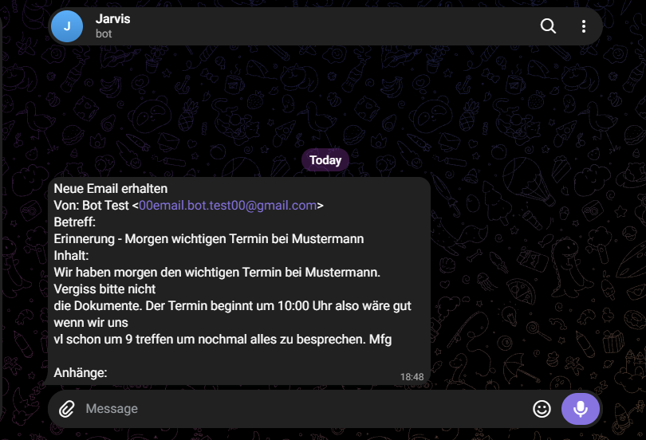

# E-Mail-Agent


## Was es tut

Der Agent prüft ein E-Mail-Postfach und schickt für jede E-Mail, die seit dem
letzten Lauf neu dazugekommen ist, eine Telegram-Nachricht mit Absender, Betreff,
Text und den Namen der Anhänge.

Welche Mail zuletzt übermittelt wurde, merkt er sich. Dieselbe E-Mail wird deshalb
nie zweimal übermittelt – auch dann nicht, wenn sie im Postfach ungelesen bleibt.


## So sieht eine Meldung aus




## Voraussetzungen

- Python 3 (entwickelt und getestet mit 3.14)
- Ein E-Mail-Postfach mit IMAP-Zugang (voreingestellt ist Gmail)
- Einen Telegram-Bot, den der BotFather anlegt

Die beiden benötigten Bibliotheken installieren:

```
pip install requests python-dotenv
```


## Einrichtung

`.env.example` zu `.env` kopieren und die vier Werte eintragen. Was hinter jeden
Wert gehört und woher er kommt, steht in der `.env.example` selbst.

Die `.env` enthält Zugangsdaten und ist deshalb von der Versionsverwaltung
ausgeschlossen.


## Starten

In den Projektordner wechseln, dann den Agenten aufrufen:

```
cd email-agent
python first_email_agent.py
```

Der Ordnerwechsel ist nicht optional: Der Agent legt seinen Merkzettel
`letzte_uid.txt` im aktuellen Verzeichnis an. Wird er von woanders gestartet,
findet er die Datei nicht, beginnt wieder bei null und meldet das gesamte
Postfach.

Bei Erfolg gibt das Programm nichts aus – das Ergebnis erscheint in Telegram.


## Stand und geplante Schritte

Aktueller Stand: **v0.1.0**. Der Agent arbeitet zuverlässig, wird aber von Hand
gestartet und trifft keine Auswahl – er meldet jede neue E-Mail.

Als Nächstes geplant:

- **Bewertung durch ein Sprachmodell.** Eingehende E-Mails werden kategorisiert
  (Anfrage, Rechnung, Newsletter), und gemeldet wird nur, was wichtig oder dringend
  ist. Umschaltbar zwischen einem Cloud-Dienst und einem lokal laufenden Modell –
  damit die Inhalte den eigenen Rechner nicht verlassen müssen.
- **Dauerbetrieb.** Zeitsteuerung, eine Logdatei über jeden Lauf und
  Fehlerbehandlung, damit der Agent ohne Aufsicht laufen kann.


## Rückmeldungen

Dieses Projekt entsteht beim Lernen, und genau deshalb ist Kritik hier nützlich:
Hinweise auf Fehler, Verbesserungsvorschläge und Anmerkungen zum Code sind
ausdrücklich willkommen – gern als Issue.
